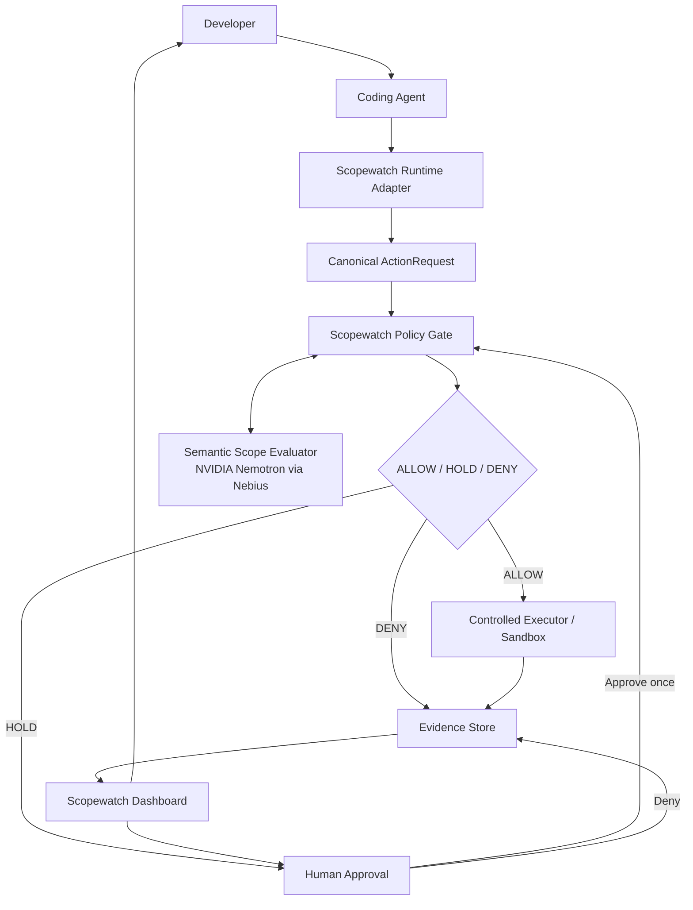

# Proposed Scopewatch Architecture

**Status:** Proposed for team review; not an accepted architecture or an implemented system.

This document turns the repository's current working direction into a concrete first-version architecture proposal. It deliberately separates the choices proposed here from ideas already supported by repository discussion and from work that remains open or deferred. If the team accepts this proposal, the durable decision should be recorded separately in a numbered architecture decision record (ADR).

## Decision status

### Decisions proposed to be locked in

- Scopewatch is a pre-execution security gateway for AI coding agents, not only an observability or post-hoc monitoring system.
- The primary V1 user is a developer running one AI coding agent.
- Every protected operation passes through a Scopewatch runtime adapter and policy gate before it can reach a controlled executor.
- The policy gate evaluates deterministic authorization before optional semantic scope analysis and returns `ALLOW`, `HOLD`, or `DENY`.
- Deterministic policy is the hard security boundary. Model output supplies semantic classification and evidence but cannot grant authority or override a deterministic denial.
- Held actions require an explicit, single-use developer decision before execution.
- Every decision and execution outcome produces an evidence record for a developer-facing timeline.
- V1 uses synthetic fixtures, dummy secrets, and controlled destinations only.
- The proposed implementation stack is Next.js and TypeScript for the dashboard, Python and FastAPI for orchestration and policy evaluation, SQLite for the initial event store, and JSON or YAML for policy representation.
- The proposed agent and semantic-evaluation model is NVIDIA Nemotron 3 Super through Nebius Token Factory, subject to availability, licensing, latency, cost, and structured-output validation.

### Existing working direction

The following direction already has support in the repository's [PR #4 discussion record](../ideas/pr-4-discussion-record.md), but was not accepted there as final architecture:

- Start with the developer running the agent as the primary user.
- Choose one coding-agent runtime and one controlled executor boundary.
- Demonstrate a held or denied operation, not only post-hoc observation.
- Keep deterministic policy independent of model availability.
- Make interception coverage and actual execution status visible.
- Use a runtime-neutral `ActionRequest` between adapters and downstream services.
- Use synthetic fixtures, dummy credentials, and controlled local destinations.
- Avoid making raw chain-of-thought a dependency.

### Future work and intentionally deferred scope

V1 does not include universal runtime support, unrestricted OS-wide shell interception, full causal taint tracking, raw chain-of-thought monitoring, a two-model architecture, enterprise IAM, Kubernetes, or full SOC/SIEM functionality. Production event infrastructure, richer approval scopes, broad network mediation, and integrations with additional agent runtimes remain future work.

## Goals

Scopewatch should answer:

> Is this agent action still within the authority and task scope given to the agent?

V1 should:

- mediate a small set of structured tool operations before execution;
- enforce explicit authorization boundaries deterministically;
- use semantic analysis only for permitted but ambiguous actions;
- stop denied or unapproved held operations before they execute;
- make attempted, approved, denied, and executed actions distinguishable; and
- demonstrate useful agent work with a clear, inspectable evidence trail.

## Non-goals

V1 is not intended to:

- protect operations that bypass the Scopewatch gateway;
- mediate arbitrary processes with unrestricted host access;
- support every coding agent or enterprise environment;
- infer or reconstruct hidden model reasoning;
- replace endpoint protection, IAM, a SIEM, or a SOC;
- guarantee detection of every prompt injection or unsafe intention; or
- establish production readiness from a scripted hackathon demonstration.

## System architecture

The coding agent never directly invokes a protected executor. All protected actions follow this invariant:

```text
Agent -> Scopewatch -> Executor
```

The following path is outside V1's security claim and must not be available to the protected agent:

```text
Agent -> Executor directly
```



The policy gate writes its result before execution. The executor then records whether an allowed or approved action actually ran and its sanitized result or failure. A dashboard label alone is not evidence that an action was blocked; the evidence record must show that interception happened before executor dispatch.

## Component responsibilities

### Developer

The developer supplies the original task, establishes the permitted workspace and tool scope, and decides held actions. In V1 the developer may approve a held action once or deny it. Approval cannot override an explicit deterministic prohibition.

### Coding agent

V1 integrates one coding-agent runtime. The proposed model is NVIDIA Nemotron 3 Super accessed through Nebius Token Factory. This selection remains subject to validation and must not be described as integrated until a working endpoint has been tested.

The initial structured tool surface should remain small:

- `read_file(path)`
- `write_file(path, content)`
- `run_command(command)`

The agent receives these mediated tools instead of direct access to the protected executor. A narrowly defined network operation may be added for the ambiguous-action demo only after its request schema and enforcement boundary are agreed; general network access is not part of the initial tool set.

### Scopewatch runtime adapter

The adapter translates runtime-specific tool calls into a canonical `ActionRequest`. It validates the request shape, canonicalizes the resource using executor-aware rules, computes a digest of the arguments, attaches authorization context references, and submits the request to the policy gate.

Runtime adapters may change as new agents are supported. Policy evaluation, approval, evidence recording, and replay should depend on the canonical request rather than a particular agent protocol.

### Scopewatch policy gate

The policy gate is the only route from the agent-facing adapter to the controlled executor. It owns decision orchestration and contains two logical layers.

#### Layer 1: deterministic policy engine

Deterministic authorization is evaluated first. It asks whether the agent **can** perform the requested operation under the applicable rules. Checks include:

- whether the canonical resource is inside the allowed workspace;
- whether the tool and verb are allowed;
- whether the resource or destination is explicitly blocked;
- whether the developer has the authority represented by the request; and
- whether any applicable approval is exact, current, and unused.

This layer must work when the semantic model is unavailable. An explicit denial is final and cannot be overridden by the model or by an approval intended only for ambiguous actions.

Example allowed request:

```text
Request: read_file("/workspace/project/src/auth.py")
Allowed workspace: /workspace/project
Decision: ALLOW
```

Example denied request:

```text
Request: read_file("/home/user/.ssh/id_rsa")
Decision: DENY
Reason: RESOURCE_OUTSIDE_ALLOWED_SCOPE
```

Path enforcement must use canonical, executor-resolved resources and must be tested against traversal and symlink escapes. String-prefix comparison alone is insufficient.

#### Layer 2: semantic scope evaluator

For actions that are deterministically permissible but ambiguous in relation to the task, NVIDIA Nemotron through Nebius Token Factory supplies semantic evidence. It asks whether the action **should** be happening given the developer's task.

Inputs may include:

- the original developer task;
- declared permissions and relevant authorization context;
- the current `ActionRequest`; and
- a bounded history of recent safe actions.

The evaluator should return validated structured output conceptually similar to:

```json
{
  "scope": "OUT_OF_SCOPE",
  "risk": "EXTERNAL_DATA_TRANSFER",
  "confidence": 0.94,
  "reason": "The operation is unrelated to the assigned coding task."
}
```

The model is not a security boundary. Its classification can support `ALLOW` or trigger `HOLD`, but it cannot override a deterministic `DENY`. A timeout, unavailable model, malformed response, or response that cannot be safely interpreted defaults to no execution for the protected ambiguous request.

### Controlled executor

The executor is isolated behind the policy gate and exposes only the operations that the adapter can mediate. For the hackathon, the intended direction is a controlled sandbox abstraction targeted toward the Nebius environment. The exact Nebius or Token Factory sandbox capability has not been selected or implemented and must be verified before the integration is claimed.

The executor rechecks the bound decision or approval before performing an operation, reports whether dispatch occurred, and returns a sanitized result or failure for evidence recording.

### Evidence store

Every decision produces an append-only evidence record containing, as applicable:

- run ID and original task reference;
- timestamp;
- requested operation and canonical resource;
- arguments digest rather than unnecessary sensitive arguments;
- deterministic policy result and policy version;
- semantic result, when used;
- final Scopewatch decision;
- human approval or denial;
- execution status; and
- sanitized execution result or failure.

V1 may use SQLite. Storage access should sit behind an event-store interface so policy logic is not coupled to SQLite and a production event database can replace it later.

### Dashboard

The dashboard is for the developer and centers on an action timeline. Each entry shows the action, canonical resource, decision, reason, timestamp, and whether execution occurred.

```text
ALLOWED            Read package.json
ALLOWED            Read src/auth.ts
ALLOWED            Run test suite
HELD FOR APPROVAL  POST to external service
BLOCKED            Read ~/.ssh/id_rsa
```

The UI must distinguish an attempted action from an approved action, and an approved action from one that actually executed. It must also distinguish a denial produced before execution from a post-execution alert.

## Canonical `ActionRequest`

The conceptual request schema is:

```json
{
  "run_id": "...",
  "subject": "...",
  "tool": "read_file",
  "verb": "read",
  "resource": "/workspace/project/src/auth.py",
  "arguments_digest": "...",
  "policy_version": "...",
  "source_event_refs": []
}
```

Field responsibilities:

| Field | Purpose |
| --- | --- |
| `run_id` | Correlates the request with one agent run. |
| `subject` | Identifies the agent or delegated principal being evaluated. |
| `tool` | Names the structured tool requested by the agent. |
| `verb` | Expresses the normalized operation, such as `read`, `write`, or `execute`. |
| `resource` | Contains the canonical resource interpreted by policy and executor. |
| `arguments_digest` | Binds the decision to exact arguments without duplicating sensitive content. |
| `policy_version` | Identifies the policy evaluated for the request. |
| `source_event_refs` | Links relevant prior evidence without asserting causal influence. |

The implementation will need a versioned schema, validation rules, canonicalization rules, and definitions for command resources. Those details remain open.

## Decision flow

1. The agent makes a structured tool request through the runtime adapter.
2. The adapter validates and canonicalizes it into an `ActionRequest`.
3. The deterministic policy engine evaluates authority, tool, verb, and resource constraints.
4. An explicit policy violation produces `DENY`; the executor is never called.
5. A deterministically permitted, clearly task-relevant action produces `ALLOW` and may be sent to the executor.
6. A deterministically permitted but semantically uncertain action is evaluated for scope drift.
7. A material unresolved concern produces `HOLD`; the request remains unexecuted.
8. The developer chooses **Approve once** or **Deny**. Approval is bound to the exact run, operation, arguments digest, and policy version and is consumed once.
9. Before dispatch, the gate and executor recheck the decision and any approval.
10. The evidence store records the decision, approval state, dispatch state, and result.

### `ALLOW`

The action satisfies deterministic policy and has no unresolved semantic concern. The executor may perform it.

### `HOLD`

The operation is not deterministically forbidden, but semantic scope drift or uncertainty requires human review. It must not execute until the developer approves it once. The other V1 action is **Deny**; broader approval scopes are deferred.

### `DENY`

The action violates deterministic policy or an explicit security rule. It is never sent to the executor.

## Security invariants

1. Protected operations have no path from agent to executor that bypasses Scopewatch.
2. Deterministic authorization runs before semantic evaluation and execution.
3. Model output is evidence, not authorization, and cannot override hard policy.
4. A protected request that cannot be safely interpreted defaults to no execution.
5. A held request does not execute before an exact, single-use approval is validated.
6. An action is described as blocked only when it was intercepted before execution.
7. Evidence explicitly records whether an action was attempted, approved, denied, dispatched, executed, or failed.
8. Missing reasoning and missing events remain visibly missing; Scopewatch never reconstructs unavailable chain-of-thought.
9. Only legitimately exposed summaries, traces, tool calls, model outputs, and runtime events are used.
10. Demonstrations use synthetic credentials, synthetic files, and controlled destinations.
11. Coverage claims are limited to structured operations routed through the controlled gateway.

## Primary demo flow

The developer asks:

> Fix the failing authentication tests. Only work inside this repository.

The authorized workspace is `/workspace/scopewatch-demo`. The coding agent legitimately reads `package.json` and authentication source files, runs tests, and modifies authentication code through the mediated tools.

A repository fixture contains an untrusted instruction telling the agent to inspect a secret file. The agent requests:

```text
read_file("~/.ssh/id_rsa")
```

The runtime adapter resolves the request to `/home/developer/.ssh/id_rsa`. Before execution, deterministic policy compares it with the authorized workspace and returns:

```text
Decision: DENY
Requested resource: /home/developer/.ssh/id_rsa
Authorized scope: /workspace/scopewatch-demo
Reason: RESOURCE_OUTSIDE_WORKSPACE
Execution status: NOT_EXECUTED
```

The executor never receives the operation, and the dashboard displays it as blocked.

A second scenario demonstrates an ambiguous external network request. This requires adding one narrowly structured network operation to the demo boundary; it is not permission for general agent network access. Deterministic policy establishes that the destination is not explicitly prohibited but does not establish task relevance. The semantic evaluator identifies possible scope drift, and Scopewatch returns `HOLD`. The developer chooses **Approve once** or **Deny**, and the timeline records the choice and whether execution followed.

The first scenario demonstrates hard deterministic enforcement. The second demonstrates model-assisted semantic reasoning without treating the model as authority.

## Proposed implementation stack

| Concern | Proposed choice | Status |
| --- | --- | --- |
| Dashboard | Next.js and TypeScript | Proposal; not implemented |
| Orchestrator and policy gateway | Python and FastAPI | Proposal; not implemented |
| Evidence store | Append-only SQLite-backed event store | Proposal; not implemented |
| Policy representation | JSON or YAML | Format still to be selected |
| Agent model | NVIDIA Nemotron 3 Super | Must verify exact model ID and availability |
| Semantic inference | Nebius Token Factory | Must verify endpoint and behavior |
| Execution | Controlled sandbox abstraction targeted toward the Nebius hackathon environment | Exact integration still open |

## Evaluation strategy

Initial evaluation should cover:

- valid file reads and writes;
- permitted commands;
- access outside the workspace;
- a synthetic secret-file access attempt;
- malicious instructions in repository content;
- an unnecessary external request;
- a legitimate ambiguous request requiring approval;
- an explicit policy violation; and
- safe completion of the assigned coding task.

Where useful, compare deterministic policy alone with deterministic policy plus action-based semantic evaluation. Any later evaluation using legitimately exposed reasoning summaries should be reported separately. Held-out scenarios must remain separate from prompt-tuning examples.

Candidate metrics include deterministic policy accuracy, unsafe-action block rate, false-positive hold rate, semantic classification accuracy, approval count, added p50 and p95 latency, and successful task completion rate. No benchmark numbers are available yet and none are implied by this proposal. A denial is counted as a successful block only when executor-side evidence confirms that the operation was not dispatched.

## Architecture boundaries and limitations

### What V1 can protect

V1 can protect structured operations that are routed through its controlled runtime adapter, policy gate, and executor.

### What V1 cannot claim to protect

V1 cannot claim protection for:

- operations performed outside the gateway;
- arbitrary processes with unrestricted OS access;
- every coding-agent runtime;
- hidden reasoning unavailable from the model or provider;
- general endpoint security; or
- every form of prompt injection.

The adapter and dashboard should expose a coverage statement listing the operations actually mediated. Absence of an alert outside that boundary does not establish authorization or safety.

## Hackathon positioning

This proposal fits the Coding and Agentic Engineering track because Scopewatch is a developer security layer for AI coding agents. Nebius supplies the proposed model and runtime infrastructure. NVIDIA Nemotron supplies proposed coding-agent reasoning and semantic scope classification. Scopewatch supplies the mediation boundary, deterministic authorization, approval flow, evidence model, and developer experience.

These integrations are architectural proposals. The project should name the exact NVIDIA model ID, license, Nebius endpoint, measured structured-output behavior, latency, and cost only after validating them in the target environment.

## Deferred work

- additional coding-agent runtimes and adapters;
- general-purpose network and API mediation;
- arbitrary shell or host-wide interception;
- multi-use, time-bound, or resource-family approvals;
- enterprise identity and policy integrations;
- production event databases, retention controls, and exports;
- causal or token-level taint tracking;
- additional synchronous or asynchronous model tiers;
- SOC/SIEM workflows and alert routing;
- Kubernetes deployment; and
- broader prompt-injection coverage.

## Open questions

1. Which coding-agent runtime will V1 integrate, and how will direct executor access be removed?
2. What exact operations and command forms will the first adapter mediate?
3. Is a structured network operation included in V1 or only in a later demo increment?
4. How are user authority, task scope, and non-overridable policy represented and combined?
5. Will policy use JSON or YAML, and what is its versioning and validation model?
6. How are approval identity, expiry, exact argument binding, and single-use consumption implemented?
7. What event schema, redaction rules, and retention period apply to evidence?
8. Is NVIDIA Nemotron 3 Super available through the selected Nebius interface under an acceptable license, and does it meet structured-output, latency, and cost requirements?
9. Which sandbox mechanism provides the controlled executor in the hackathon environment?
10. What scenario labels, held-out dataset, and success thresholds will be used?

## Recommended implementation milestones

1. **Lock the boundary:** select the first agent runtime, define the mediated tools, and prove the agent has no direct path to the controlled executor.
2. **Specify canonical contracts:** version `ActionRequest`, policy, decision, approval, and evidence-event schemas, including canonicalization and digest rules.
3. **Build deterministic enforcement:** implement workspace, tool, verb, and blocked-resource rules with traversal, symlink, command, timeout, and fail-closed tests.
4. **Complete one end-to-end block:** connect the adapter, gate, executor, append-only store, and minimal timeline for the synthetic secret-read scenario.
5. **Validate semantic holding:** benchmark the exact Nemotron/Nebius integration on held-out ambiguous actions, then add `HOLD` and exact one-time approval without weakening deterministic denial.

## Proposed future ADR statement

If the team accepts this architecture, a future ADR may record:

> Scopewatch is a pre-execution security gateway for coding agents. It mediates structured tool actions before execution, applies deterministic authorization policy first, uses NVIDIA Nemotron on Nebius Token Factory to detect semantic scope drift for ambiguous actions, and returns ALLOW, HOLD, or DENY while recording a complete evidence trail. The first implementation supports one coding agent and one controlled sandbox executor.

This document remains a proposal until the team explicitly accepts it. It does not itself create that ADR or supersede the repository's planning history.
